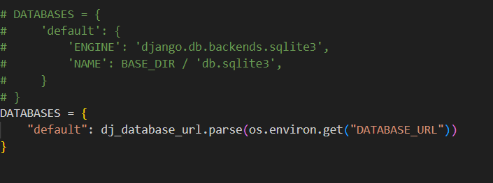

**** I have deployed it on render for free. But it get automatcally shoutdown after every 15 minutes of inactivity because  I am using free version. ****
------------------------------------------------------------------------------------
The Event Trigger Platform is a powerful tool designed to schedule and manage automated triggers based on fixed schedules or API requests. This platform supports both one-time and recurring triggers, providing flexibility for various automation needs.
-----------------------------------------------------------------------------------

1. Clone the Repository : git clone https://github.com/Datakumariiit/Event-Trigger-Platform.git
2. pip install -r requirements.txt
3. python manage.py makemigrations
4. python manage.py migrate
5. python manage.py runserver
6. Go to : http://localhost:8000./swagger/
7.   Uncomment the uppder database configeration and comment down below data base.
                In settings.py change-->
                # DATABASES = {
                #     'default': {
                #         'ENGINE': 'django.db.backends.sqlite3',                    ---> Uncomment this database
                #         'NAME': BASE_DIR / 'db.sqlite3',
                #     }
                # }
                DATABASES = {
                    "default": dj_database_url.parse(os.environ.get("DATABASE_URL"))        ----> Comment this database.
                }   

8. API Endpoints:
    1. Create Trigger
       Endpoint: POST/create_trigger/
       payload Example:  {
                              "name": "Sample Trigger",
                              "trigger_type": "scheduled",
                              "schedule_time": "2025-03-20T15:30:00Z",
                              "interval": "30m",
                              "api_payload": { "key": "value" }
                          }
    2. List Triggers
        Endpoint: GET /list_triggers/

    3. Delete Trigger
        Endpoint: DELETE /delete_trigger/{id}/
        payload: id

    4. Trigger Event
        Endpoint: POST /trigger_event/{trigger_id}/
        payload: trigger_id

-------------------------------------------------------------------------------------------
Features

Scheduled Triggers: Fire at a specific time, fixed intervals, or recurring schedules.

API Triggers: Fire based on incoming API requests with predefined JSON schemas.

Flexible Scheduling: Supports dynamic intervals (e.g., "every 30 minutes" or "once at 5 PM").

Robust Error Handling: Ensures proper management of failed triggers.

Secure and Scalable: Built using Django and DRF for optimal performance.

-------------------------------------------------------------------------------
